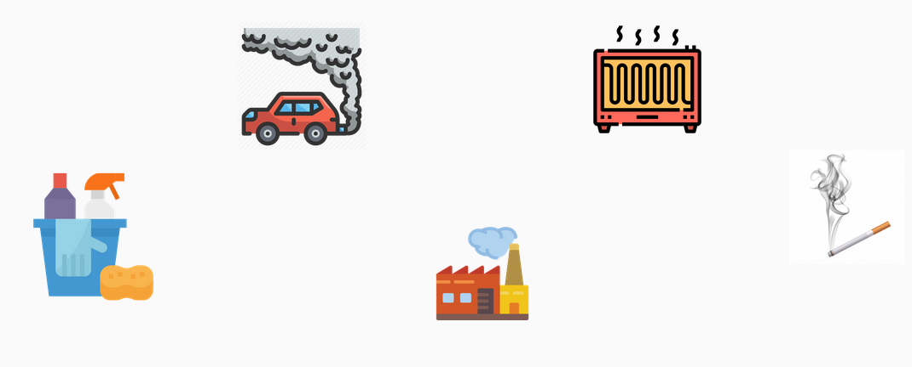
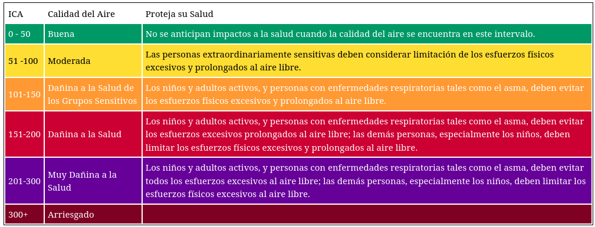
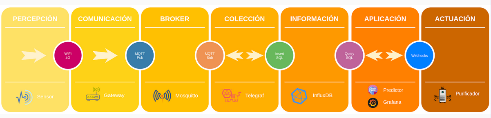
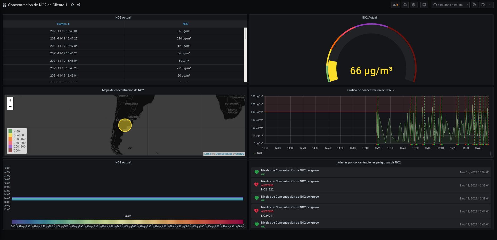

# Purificador de aire autónomo

El objetivo de este proyecto es proponer una aplicación smart IoT utilizando tecnologías *Open source*.

## Problema

La **calidad del aire interior** se aplica a ambientes de interiores no industriales: edificios de oficinas, edificios públicos (colegios, lugares de ocio, restaurantes, etc.) y viviendas particulares. En los últimos años ha cobrado especial relevancia al asociarse al término “síndrome del edificio enfermo” que comprende un amplio rango de síntomas o enfermedades que las personas que trabajan o habitan en dicho edificio atribuyen al edificio en sí.

En el aire interior se encuentra una mezcla de contaminantes procedentes de diferentes fuentes. Una de ellas puede ser el aire exterior que puede introducir contaminantes que no se originan en este ambiente. Pero también existen contaminantes que se encuentran en el interior, como los materiales de construcción, los productos de limpieza o el propio mobiliario. Fumar, evidentemente, amplía el aire nocivo para la salud. Otras fuentes de contaminantes químicos en una casa son los aparatos de calefacción, las cocinas, estufas o los refrigeradores y hornos de gas, que pueden liberar distintos contaminantes 

Una calidad de aire deficiente, puede producir problemas respiratorios en individuos sanos y agudizar la enfermedad en personas que ya sufren patologías cardio-pulmonares crónicas. En general, puede provocar infecciones respiratorias como asma, lipoatrofia, alergias e, incluso, cáncer de pulmón.



Algunos de los agentes contaminantes más comunes son:

- Monóxido de azufre (SO)
- Dióxido de nitrógeno (NO2)
- Dióxido de carbono (CO2)
- Ozono (O3)
- Partículas totales en suspensión (PST)

En este proyecto, por simplicidad, nos concentraremos solamente en el NO2. De acuerdo a [Índice de calidad del aire de EE. UU. (AQI)](https://aqicn.org/scale/) se tiene la siguiente escala para el NO2: 




## Solución

Medir las concentración de NO2 en el aire a través de sensores. En caso de detectar concentraciones peligrosas se activará en forma automática los purificadores que realizan una filtración del aire que ingresa desde el exterior y extrayendo el aire viciado, asegurando así la calidad del aire interior.

Por otro lado, con la información que se recolecta en el tiempo, poder realizar un pronóstico de las concentraciones de NO2 con cierto grado de confiabilidad, de manera que el purificador sea activado antes que se produzca el evento no deseado.

### Arquitectura

Las concentraciones de NO2 son obtenidas por sensores que se encuentran en el interior del edificio. La información es enviada a un *gateway* que debe existir en cada instalación, el cual se encarga de realizar algunos formateos de los datos y publicarlos de manera segura por el protocolo MQTT. Telegraf se encarga de estar suscripto al tópico en que publican los *gateways* y persistir los datos en una base de datos InfluxDB. 

Con el historial de los datos, tenemos un proceso que intenta predecir las próximas concentraciones, de manera que se pueda alertar antes de que sucedan concentraciones peligrosas. 

Por otro lado, en grafana se configuran los *dashboards* para visualizar las concentraciónes de NO2 y se establecen las alertas (concentración de NO2 mayor a 150 microgramos por metro cúbico) que se comunican con los purificadores a tavés de un *webhook* para que se prenda o apague. Estas alertas son configuradas tanto con la detección en tiempo real de concentraciones peligrosas, así como de las recibidas por el predictor.



### Implementación

El proyecto simula con JMeter las publicaciones de NO2 a través de MQTT. JMeter se encuentra configurado como servicio dentro de docker, en el cuál además se incluye un broker MQTT (mosquitto), Telegraf, InfluxDB y Grafana. Por cuestiones de tiempo, actualmente no se encuentra implementado el predictor.

Para correr el proyecto debe ejecutar el siguiente comando:

```
docker-compose up -d
```

Para que las publicaciones se ejecuten se debe entrar al contenedor de JMeter:

```
docker-compose exec jmeter bash
```

Una vez dentro del contenedor puede correr las publicaciones de NO2 donde no ocurra ninguna condición de alerta (concentración de NO2 menor a 150 microgramos por metro cúbico):

```
jmeter -n -t sample-test/test_ok.jmx &
```

O en caso que se quiera simular situaciones de riesgo para la salud (concentración de NO2 mayor a 150 microgramos por metro cúbico):

```
jmeter -n -t sample-test/test_alerting.jmx &
```

Esto publicará métricas en el broker MQTT aproximadamente cada un minuto.

En grafana se pueden ver las publicaciones y el historial de alertas en [http://localhost:3000](http://localhost:3000):




### TODO

Como comente anteriormente, queda pendiente el predictor, así como también incluir otras variables que puedan afectar el nivel de concentraciones de NO2, tales como pueden ser la temperatura y la humedad relativa, de manera que se pueda alimentar al predictor con más variables y pueda mejorar su pronóstico.

## Fuentes

- [Calidad del  aire interior](https://iescelia.org/web/wp-content/uploads/2020/08/H19ventilacio-juntaandalucia-guiaOSMAN.pdf)
- [Grafana](https://grafana.com/)
- [Telegraf](https://www.influxdata.com/time-series-platform/telegraf/)
- [InfluxDB](https://www.influxdata.com/products/influxdb/)
- [Worldmap Panel Plugin for Grafana](https://grafana.com/grafana/plugins/grafana-worldmap-panel/?tab=installation)
- [Hourly Heatmap for Grafana](https://grafana.com/grafana/plugins/marcusolsson-hourly-heatmap-panel/)
- [Air Quality Index Scale and Color Legend](https://aqicn.org/scale/)